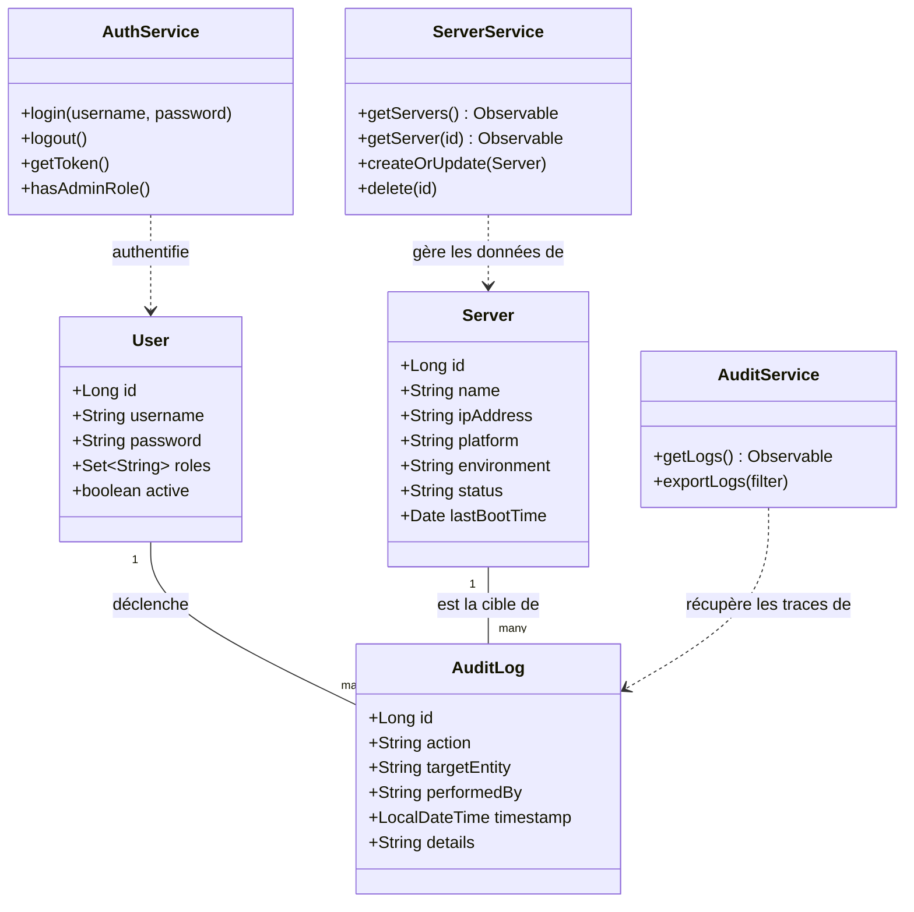

# 🏛️ Documentation de l'Architecture du Projet

Ce document contient la structure technique et les diagrammes de classe pour les parties Front-end (Angular) et Back-end (Spring Boot).

---

## 🔵 Architecture Globale

Ce flux illustre la communication entre l'interface utilisateur et la base de données via l'API REST sécurisée par JWT.

```mermaid
graph TD
    subgraph Client_Side ["🔵 Front-end (Angular)"]
        UI[Composants UI / HTML] --> Service[Services API]
        Service --> Interceptor[Auth Interceptor (JWT)]
        Interceptor --> Guards[Auth Guards (Rôles)]
        Env[environment.ts] -.-> Service
    end

    subgraph Server_Side ["🟢 Back-end (Spring Boot)"]
        Security[Security / JWT Filter] -- Filtre -- > Controller[REST Controllers]
        Controller --> BizLogic[Service Layer]
        BizLogic --> Mapping[Mappers (DTO ↔ Entity)]
        BizLogic --> DBQuery[Repositories (JPA)]
        DBQuery --> Entity[Entities / JPA Models]
    end

    subgraph Persistence ["💾 Base de Données"]
        DB[(PostgreSQL / MySQL)]
    end

    %% Communication
    Interceptor -- "Requêtes HTTP (JSON + Token)" --> Security
    Entity -- "SQL" --> DB
    DB -- "ResultSet" --> Entity
    Mapping -- "JSON Response" --> UI

    style Client_Side fill:#f0f7ff,stroke:#0056b3
    style Server_Side fill:#f6fff0,stroke:#28a745
    style Persistence fill:#fffbf0,stroke:#d39e00
```

---

## 📊 Diagramme de Classe (Back-end & Front-end)

Ce diagramme présente les entités métier principales et leurs relations.


